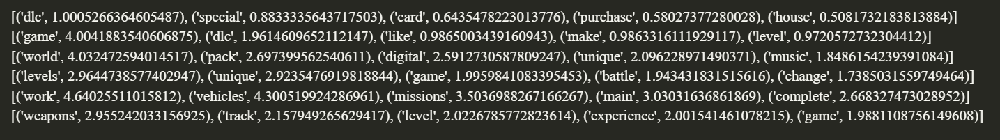

# [Presentation](./main.pdf)
# Additional results
## Reversing input encoding after PCA
PCA analysis calculates the most important features, that means it constructs new axis (words, lets call them perfect) that are linear combinations of the original features. So, we could try to reverse this transformation and see how those perfect word would look like. Since we did not define how linear combination of words would create a new word, we can just check the highest coefficients and their corresponding words.  

First _6_ perfect words from PCA, and _5_ of their corresponding words with coefficients:

